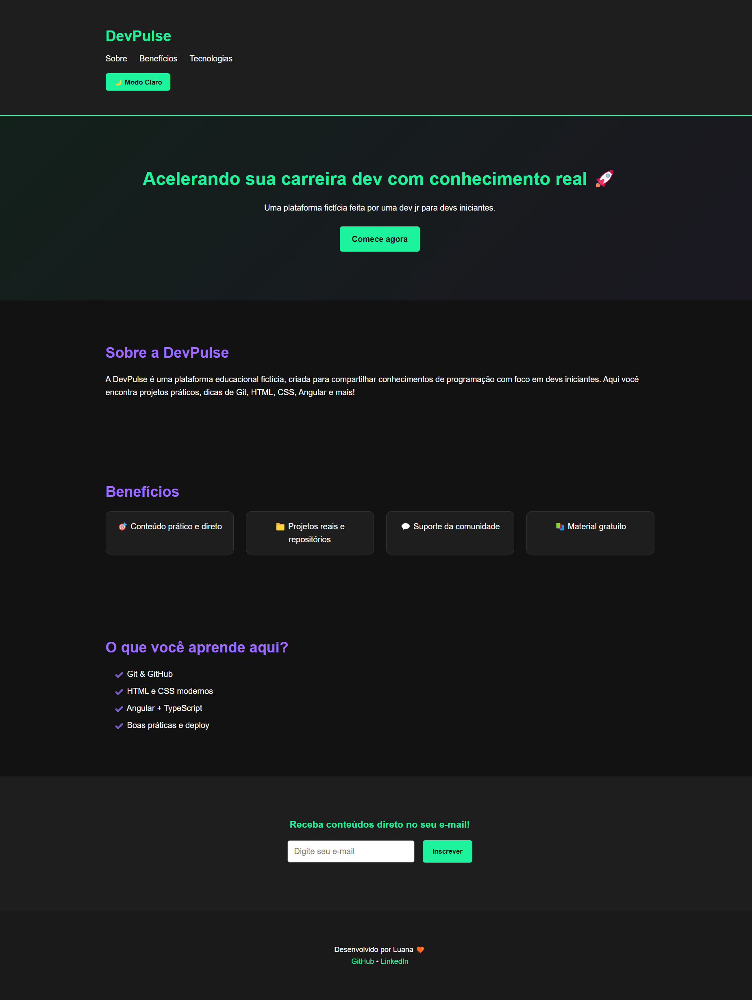
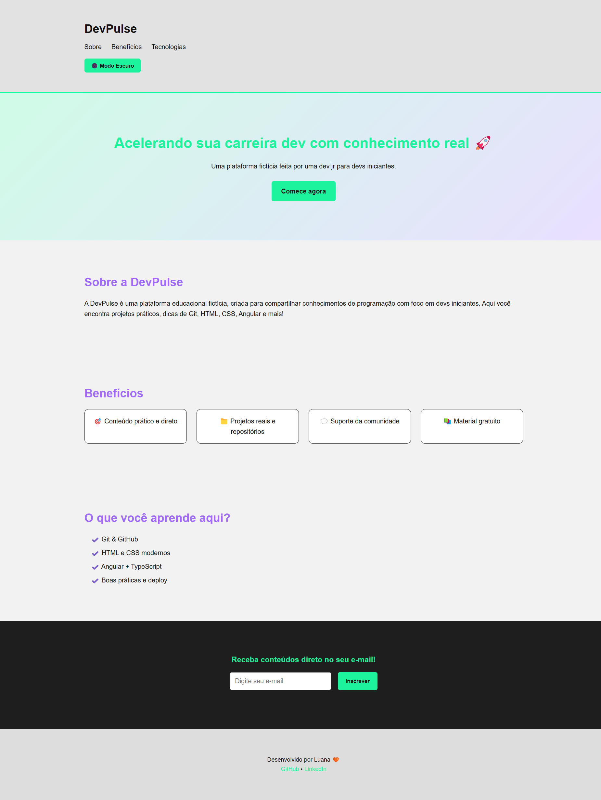
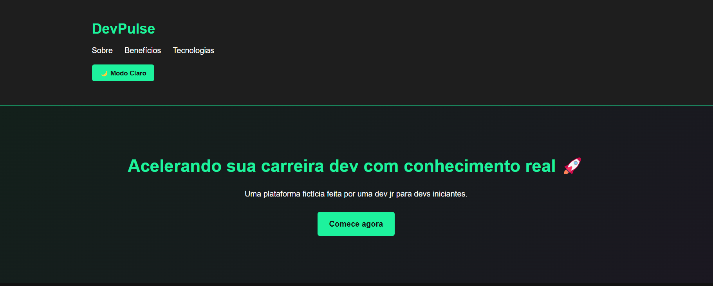
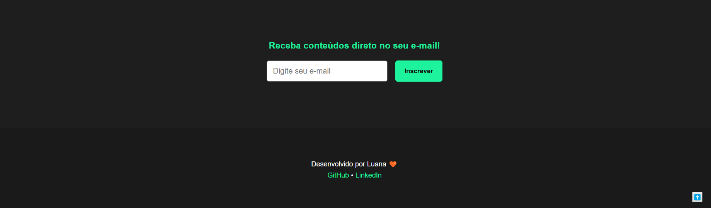

# DevPulse Landing

Este projeto foi desenvolvido com o objetivo de **praticar e reforçar conhecimentos básicos da trinca de Front-end** — **HTML**, **CSS** e **JavaScript** — e faz parte da minha **trilha de estudos pessoal**.

A **DevPulse** é uma **marca fictícia** criada exclusivamente para o desenvolvimento desta landing page. O projeto é composto por diferentes blocos e funcionalidades:

## ✨ Estrutura e Funcionalidades

- **Header** com menus: Benefício, Sobre e Tecnologias.
- Botão de **mudança de tema** (claro/escuro).
- **Bloco de convite**: incentiva o usuário a iniciar sua trilha na plataforma.
- Ao clicar no botão "Iniciar", o usuário é redirecionado para o próximo bloco, que apresenta:
  - **Sobre** a marca fictícia.
  - **Tecnologias** utilizadas.
  - **Benefícios** distribuídos em cards.
- **Formulário** para o usuário optar por receber ou não os conteúdos da plataforma via e-mail.
- **Rodapé** com links para minhas redes sociais, para quem quiser curtir e dar sugestões.
- Botão de **"Voltar ao Topo"** no canto inferior, com função **smooth scroll**.

---

## 🛠 Tecnologias Utilizadas

- **HTML5**
- **CSS3**
- **JavaScript**

---

## 📸 Preview

---

## 🔗 Deploy

Acesse o projeto online: **[DevPulse Landing](https://luaasantos.github.io/devpulse-landing/)**

---

## 📬 Contato

- GitHub: [@luaasantos](https://github.com/luaasantos)
- LinkedIn: [Luana Santos](https://www.linkedin.com/in/luana-santos)

---

